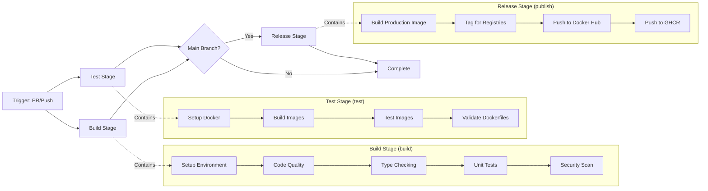

# CI/CD Architecture

## Table of Contents

- [Overview](#overview)
- [Pipeline Architecture](#pipeline-architecture)
- [Pipeline Stages](#pipeline-stages)
  - [Build Stage (build job)](#build-stage-build-job)
  - [Test Stage (test job)](#test-stage-test-job)
  - [Release Stage (publish job)](#release-stage-publish-job)
- [Key Architectural Decisions](#key-architectural-decisions)
  - [1. Parallel Execution Strategy](#1-parallel-execution-strategy)
  - [2. Integrated Security Scanning](#2-integrated-security-scanning)
  - [3. Dynamic Version Management](#3-dynamic-version-management)
  - [4. Just as Unified Interface](#4-just-as-unified-interface)
  - [5. Multi-Registry Publishing](#5-multi-registry-publishing)
  - [6. Branch-Based Build Optimization](#6-branch-based-build-optimization)
- [Performance Characteristics](#performance-characteristics)
- [Debugging and Troubleshooting](#debugging-and-troubleshooting)
  - [Build Stage Failures](#build-stage-failures)
  - [Test Stage Failures](#test-stage-failures)
  - [Release Stage Failures](#release-stage-failures)
- [Local Development](#local-development)
  - [Running CI Checks Locally](#running-ci-checks-locally)
  - [Understanding CI Command Hierarchy](#understanding-ci-command-hierarchy)
  - [Workflow Selection Guide](#workflow-selection-guide)
- [Environment Variables](#environment-variables)
- [Related Documentation](#related-documentation)
- [Future Improvements](#future-improvements)

---

## Overview

This document explains the architectural design and key decisions behind the ATS PDF Generator CI/CD pipeline. The pipeline emphasizes fast feedback, security-first validation, and efficient resource utilization through parallel execution and branch-based optimization.

**Design Philosophy**: Fail fast, fail early—integrate security and quality checks into the build stage for immediate feedback rather than waiting for separate jobs to complete.

## Pipeline Architecture



**Key Characteristics**:

- **Parallel Execution**: Build and Test stages run simultaneously (~40% time savings)
- **Branch-Based Optimization**: PRs build/test only standard image, main builds all variants
- **Fail Fast**: Security and quality checks integrated into build stage for immediate feedback
- **Conditional Release**: Publishing only runs on main branch after both stages pass

## Pipeline Stages

### Build Stage (`build` job)

**Purpose**: Validate code quality, security, and correctness before any integration testing.

**Runs on**: All PRs and main branch pushes

**Key Responsibilities**:

- Python code quality (ruff linting, formatting checks)
- Type safety validation (mypy)
- Unit test execution with coverage reporting
- Security scanning for HIGH/CRITICAL vulnerabilities (Trivy)
- Shell script validation (shellcheck)
- Markdown linting (markdownlint)

**Key Architectural Decisions**:

1. **Integrated Security Scanning**: Security scanning runs in the build stage rather than as a separate job. This provides faster feedback—developers know within minutes if their PR introduces vulnerabilities rather than waiting for a separate security job to start.

2. **Dynamic Version Management**: All tool versions (Python, Node.js, pnpm, hadolint) are extracted from `mise.toml` at runtime, ensuring the CI environment exactly matches local development environments. No version drift.

3. **Just as Unified Interface**: Uses `just ci` as the entry point, providing perfect parity between local development and CI. Developers can run exactly what CI runs with one command.

**Duration**: ~3-5 minutes

**Reference**: `.github/workflows/ci.yml` lines 22-93

---

### Test Stage (`test` job)

**Purpose**: Validate Docker images build correctly and function as expected through integration testing.

**Runs on**: All PRs and main branch pushes (parallel with build stage)

**Key Responsibilities**:

- Build Docker image variants (alpine, standard, dev)
- Functional testing of built images
- Dockerfile validation with hadolint
- Security checksum verification for tools

**What it runs**:

```bash
just _ci-build-docker    # Branch-optimized: builds standard only on PRs, all on main
just _ci-test-docker     # Tests corresponding images
just validate-dockerfiles  # Hadolint validation
```

**Key Architectural Decisions**:

1. **Branch-Based Optimization**: On pull requests, only the standard image is built and tested. On main branch, all three variants (alpine, standard, dev) are built. This saves ~60% of Docker build time on PRs while ensuring comprehensive testing before release.

2. **Parallel with Build**: Runs simultaneously with the build stage rather than sequentially. Since Docker builds don't depend on Python quality checks, we can start immediately and save 3-5 minutes per pipeline run.

3. **Security-First Tool Installation**: hadolint binary is downloaded with SHA256 checksum verification. No trust, verify before execution.

**Duration**:

- PR branches: ~2-3 minutes (standard image only)
- Main branch: ~5-7 minutes (all three variants)

**Reference**: `.github/workflows/ci.yml` lines 95-135

---

### Release Stage (`publish` job)

**Purpose**: Publish verified, tested Docker images to container registries.

**Runs on**: Main branch only, after both build and test stages pass

**Key Responsibilities**:

- Build production-ready standard image
- Tag images for multiple registries
- Authenticate with Docker Hub and GitHub Container Registry
- Push images to both registries

**What it runs**:

```bash
just publish latest  # Builds, tags, and pushes to both registries
```

**Key Architectural Decisions**:

1. **Multi-Registry Publishing**: Publishes to both Docker Hub and GitHub Container Registry (GHCR) for maximum availability. If one registry has issues, users can pull from the other.

2. **Main Branch Only**: Publishing is gated behind main branch protection. No accidental releases from PRs or feature branches.

3. **Dependent on Quality Gates**: Requires both `build` and `test` jobs to pass. Images are never published without full validation.

4. **Minimal Permissions**: Uses `contents: read, packages: write` permissions—only what's needed, nothing more.

**Duration**: ~3-4 minutes

**Reference**: `.github/workflows/ci.yml` lines 137-177

---

## Key Architectural Decisions

### 1. Parallel Execution Strategy

**Decision**: Run build and test stages in parallel rather than sequentially.

**Rationale**:

- Docker image testing doesn't depend on Python code quality
- Saves 3-5 minutes per pipeline run (~40% improvement)
- Provides faster overall feedback to developers
- Still maintains quality gates before publishing

**Trade-offs**:

- ✅ Faster feedback loop for developers
- ✅ Better CI resource utilization
- ❌ Both jobs consume runner resources simultaneously
- ❌ Slightly higher complexity in dependency management

---

### 2. Integrated Security Scanning

**Decision**: Security scanning (Trivy) runs as part of the build stage, not as a separate job.

**Rationale**:

- Developers get security feedback in ~3 minutes instead of waiting for a separate job
- Fail fast principle—no point building Docker images if code has HIGH/CRITICAL vulnerabilities
- Reduces total pipeline time by eliminating job scheduling overhead
- Simplifies mental model—quality includes security

**Configuration**:

```yaml
env:
  CI_STRICT_SECURITY: true  # Fails build on HIGH/CRITICAL findings
```

**What it scans**:

- Python dependencies for HIGH/CRITICAL vulnerabilities
- Source code for exposed secrets (API keys, tokens)
- Produces SARIF output for GitHub Security tab integration

**Trade-offs**:

- ✅ Faster security feedback
- ✅ Simpler pipeline with fewer jobs
- ✅ Stronger fail-fast behavior
- ❌ Build stage takes slightly longer
- ❌ Can't selectively re-run only security scans

---

### 3. Dynamic Version Management

**Decision**: Extract all tool versions from `mise.toml` at runtime rather than hardcoding in CI config.

**Implementation**:

```bash
./scripts/extract-versions.sh python   # Returns: 3.12.5
./scripts/extract-versions.sh node     # Returns: 20.11.0
./scripts/extract-versions.sh pnpm     # Returns: 8.15.3
./scripts/extract-versions.sh hadolint # Returns: 2.12.0
```

**Rationale**:

- **Single Source of Truth**: `mise.toml` defines versions for both local development and CI
- **Zero Version Drift**: CI always uses exactly what developers use locally
- **Easy Updates**: Change version in one place, applies everywhere
- **Tool Consistency**: Same Python version, same linting rules, same behavior

**Trade-offs**:

- ✅ Eliminates "works on my machine" issues
- ✅ Simplifies version upgrades
- ✅ Guarantees environment consistency
- ❌ Adds dependency on `mise.toml` being correct
- ❌ Slightly more complex CI setup steps

---

### 4. Just as Unified Interface

**Decision**: Use Just task runner as the primary interface for all CI operations.

**Local Development Parity**:

```bash
# Developers run locally:
just ci

# CI runs exactly:
just ci
```

**Rationale**:

- **Perfect Parity**: CI runs identical commands to local development
- **Easier Debugging**: Developers can reproduce CI failures locally with one command
- **Abstraction Layer**: CI doesn't need to know implementation details
- **Maintainability**: Change build logic in justfile, CI automatically uses it

**What `just ci` actually does**:

```bash
lint            # Lint all code (Python, shell, markdown)
format-check    # Verify code is formatted correctly
typecheck       # Run mypy type checking
test-python     # Run pytest with coverage
security        # Scan for vulnerabilities and secrets
_ci-build-docker   # Build appropriate Docker images for branch
_ci-test-docker    # Test built images
validate-dockerfiles  # Hadolint validation
```

**Trade-offs**:

- ✅ Consistent behavior between local and CI
- ✅ Easier for developers to debug failures
- ✅ Centralized task management
- ❌ Adds dependency on Just tool
- ❌ CI logs show less granular steps

---

### 5. Multi-Registry Publishing

**Decision**: Publish to both Docker Hub and GitHub Container Registry.

**Rationale**:

- **Availability**: If one registry is down, users can pull from the other
- **Discoverability**: Docker Hub has better discoverability for public projects
- **Integration**: GHCR integrates tightly with GitHub releases and security scanning
- **No Cost**: Both registries are free for public images with unlimited downloads

**Registry Strategy**:

| Registry | Primary Use Case | URL Pattern |
|----------|------------------|-------------|
| Docker Hub | Public discovery, default install | `dohdalabs/ats-pdf-generator:latest` |
| GHCR | GitHub integration, CI/CD | `ghcr.io/dohdalabs/ats-pdf-generator:latest` |

**Trade-offs**:

- ✅ Better availability and reliability
- ✅ Broader user reach
- ✅ Redundancy if one registry has issues
- ❌ Doubles publishing time
- ❌ Must maintain credentials for both registries

---

### 6. Branch-Based Build Optimization

**Decision**: Build only standard image on PRs, all variants on main branch.

**Implementation**:

```bash
# In justfile
[private]
_ci-build-docker:
    if [ "${GITHUB_REF}" = "refs/heads/main" ]; then
        just build-all  # Builds: alpine, standard, dev
    else
        just build      # Builds: standard only
    fi
```

**Rationale**:

- **Faster PR Feedback**: Standard image is sufficient to validate functionality
- **Resource Efficiency**: Saves ~60% of Docker build time on PRs
- **Comprehensive Testing**: Main branch still validates all variants before release
- **Good Enough Quality Gate**: If standard works, others likely work too

**Build Matrix**:

| Branch | Images Built | Duration | Rationale |
|--------|-------------|----------|-----------|
| PR | standard | ~2-3 min | Fast feedback, validates core functionality |
| main | alpine, standard, dev | ~5-7 min | Comprehensive validation before release |

**Trade-offs**:

- ✅ Significantly faster PR builds
- ✅ Better CI resource utilization
- ✅ Maintains quality for releases
- ❌ Rare variant-specific bugs might reach main
- ❌ Adds conditional complexity to build logic

---

## Performance Characteristics

Based on typical runs:

| Pipeline Type | Total Duration | Build Stage | Test Stage | Release Stage |
|---------------|----------------|-------------|------------|---------------|
| **PR (non-main)** | ~5-7 minutes | 3-5 min | 2-3 min (standard only) | N/A |
| **Main push** | ~12-15 minutes | 3-5 min | 5-7 min (all variants) | 3-4 min |

**Parallelization Benefit**: ~40% faster than sequential execution

**Bottleneck**: Docker image builds on main branch (5-7 minutes)

**Optimization Opportunities**:

- Layer caching could reduce Docker build time by ~30%
- Test parallelization could reduce test stage by ~20%
- Artifact caching between jobs could save 1-2 minutes

---

## Debugging and Troubleshooting

### Build Stage Failures

**Common Causes**:

1. **Linting Failures**: Code doesn't pass ruff checks
   - **Local Debug**: `just lint-python`
   - **Fix**: `just format-python` (auto-fixes most issues)

2. **Type Errors**: mypy finds type inconsistencies
   - **Local Debug**: `just typecheck-python`
   - **Fix**: Add proper type hints or type ignores

3. **Security Vulnerabilities**: Trivy finds HIGH/CRITICAL issues
   - **Local Debug**: `just security`
   - **Fix**: Update vulnerable dependencies with `uv lock --upgrade`

4. **Test Failures**: Pytest tests fail
   - **Local Debug**: `just test-python`
   - **Fix**: Fix failing tests or update test assertions

**Pro Tip**: Run `just ci` locally before pushing—it runs exactly what CI runs.

---

### Test Stage Failures

**Common Causes**:

1. **Docker Build Failures**: Image fails to build
   - **Local Debug**: `just build` or `just _build-docker alpine`
   - **Check**: Dockerfile syntax, base image availability, build args

2. **Image Functionality Failures**: Built image doesn't work correctly
   - **Local Debug**: `just _test-docker-image standard`
   - **Check**: Entrypoint configuration, file permissions, dependencies

3. **Dockerfile Validation Failures**: hadolint finds issues
   - **Local Debug**: `just validate-dockerfiles`
   - **Fix**: Follow hadolint recommendations for best practices

**Pro Tip**: Use `just docker-shell` to interactively debug inside a container.

---

### Release Stage Failures

**Common Causes**:

1. **Authentication Failures**: Can't log in to registries
   - **Check**: `DOCKERHUB_USERNAME`, `DOCKERHUB_TOKEN` secrets configured
   - **Check**: GitHub token has `packages: write` permission

2. **Push Failures**: Can't push to registry
   - **Check**: Registry quotas and rate limits
   - **Check**: Image name conflicts or permissions

3. **Tag Conflicts**: Version tag already exists
   - **Fix**: Use unique version tags, avoid reusing tags

**Pro Tip**: Publishing only runs on main branch—test on PRs won't reveal these issues.

---

## Local Development

### Running CI Checks Locally

```bash
# Fast checks (~30 seconds) - run frequently during development
just quick

# Thorough checks (~3 minutes) - run before committing
just check

# Complete CI pipeline (~10 minutes) - run before pushing
just ci
```

### Understanding CI Command Hierarchy

```bash
just ci
├── lint                     # Lint all code
│   ├── lint-python         # ruff check
│   ├── lint-shell          # shellcheck
│   └── lint-markdown       # markdownlint
├── format-check            # Verify formatting (no changes)
│   └── _format-check-python  # ruff format --check
├── typecheck               # Type checking
│   └── typecheck-python    # mypy
├── test-python             # Run tests with coverage
├── security                # Security scanning with Trivy
├── _ci-build-docker        # Build images (branch-optimized)
├── _ci-test-docker         # Test images (branch-optimized)
└── validate-dockerfiles    # Dockerfile linting
```

### Workflow Selection Guide

| Scenario | Command | Duration | What It Does |
|----------|---------|----------|--------------|
| Active development | `just quick` | ~30s | Fast checks for immediate feedback |
| Before committing | `just check` | ~3min | Thorough validation, matches pre-commit |
| Before pushing | `just ci` | ~10min | Full CI pipeline, guarantees PR will pass |
| Python changes only | `just lint-python test-python` | ~1min | Focused validation |
| Docker changes only | `just build test-docker` | ~3min | Docker-specific validation |

---

## Environment Variables

```yaml
CI: true                      # Indicates CI environment
UV_COMPILE_BYTECODE: 1       # Optimizes Python bytecode compilation
CI_STRICT_SECURITY: true     # Fails build on HIGH/CRITICAL security findings
```

**Impact**:

- `CI=true`: Changes behavior of install scripts (skips pre-commit hooks)
- `UV_COMPILE_BYTECODE=1`: Improves Python startup time in containers
- `CI_STRICT_SECURITY=true`: Enables strict security scanning mode with Trivy

---

## Related Documentation

- [`.github/workflows/ci.yml`](../.github/workflows/ci.yml) - Actual pipeline definition
- [`justfile`](../justfile) - Task definitions used by CI
- [`DEVELOPMENT.md`](../DEVELOPMENT.md) - Local development workflows
- [`docs/DOCKER_DISTRIBUTION.md`](DOCKER_DISTRIBUTION.md) - Registry setup and publishing
- [`.cursor/rules/justfile-standards.mdc`](../.cursor/rules/justfile-standards.mdc) - Justfile conventions

---

## Future Improvements

### Performance Optimizations

- **Docker Layer Caching**: Implement BuildKit cache backends (~30% faster builds)
- **Test Parallelization**: Run pytest with `-n auto` (xdist)
- **Artifact Caching**: Share built artifacts between jobs

### Security Enhancements

- **Container Signing**: Sign published images with cosign
- **SBOM Generation**: Generate Software Bill of Materials
- **Runtime Scanning**: Add container runtime security scanning

### Monitoring

- **Build Metrics**: Track pipeline duration trends
- **Failure Analysis**: Categorize and track failure patterns
- **Cost Optimization**: Monitor CI minute usage and optimize hot paths

**Last Updated**: 2025-10-15
